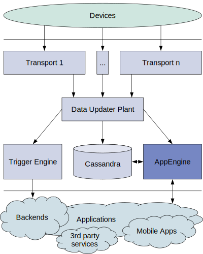

Astarte App Engine
==================

Astarte App Engine serves a [REST API](priv/static/astarte_appengine_api.yaml) that allows applications to gather and send data to the devices fleet.

REST API documentation can be viewed at http://appenginehost:4002/swagger/ .
