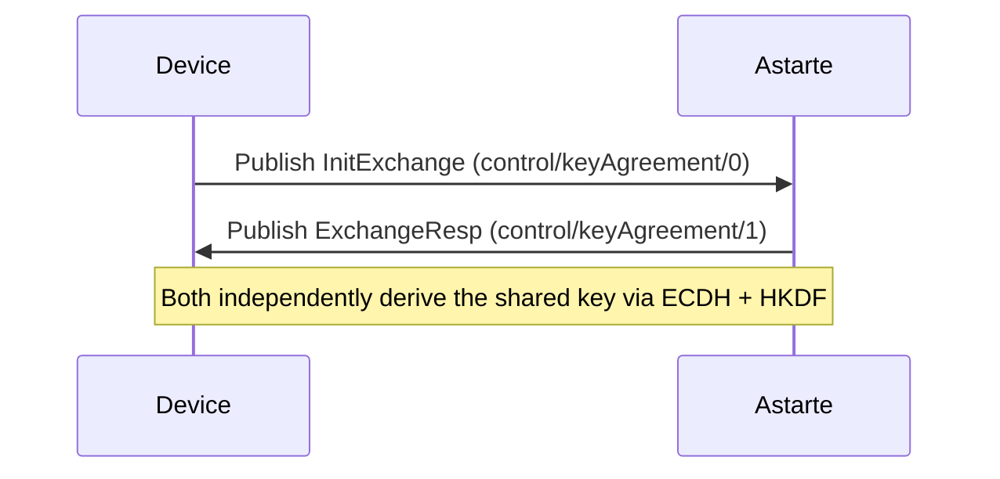
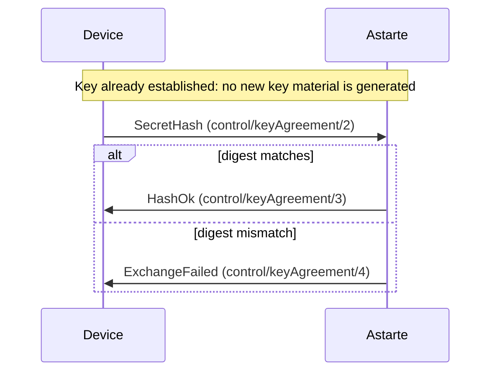
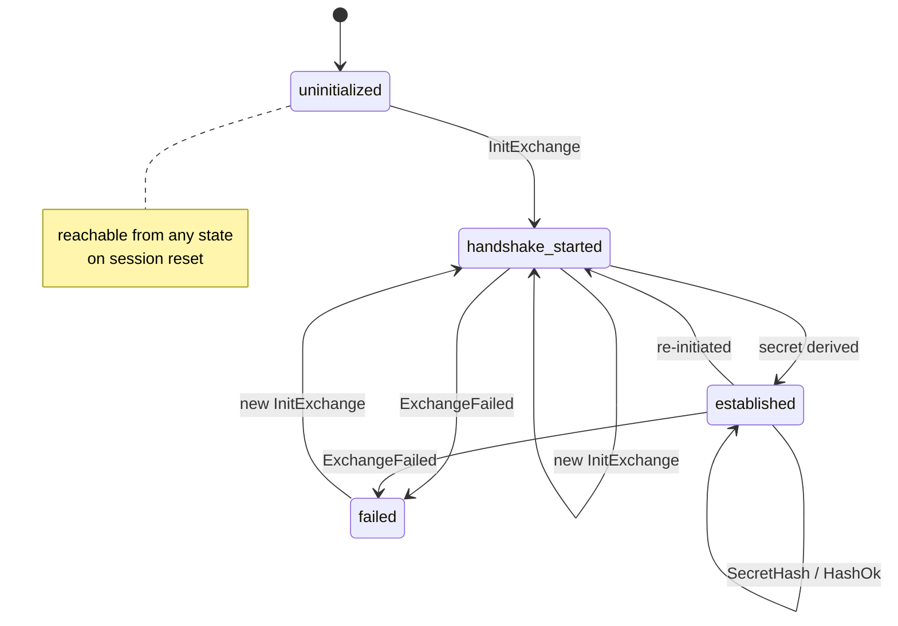

# Key Agreement and Encrypted Endpoints

Astarte interfaces can mark individual mappings as **encrypted**. Payloads published on those
endpoints will not travel in plaintext between a device and Astarte. To achieve this, a device and
Astarte perform a **Key Agreement** handshake to independently derive a shared symmetric key, which
is then used to encrypt and decrypt data exchanged on that specific MQTT session.

This page describes the Key Agreement handshake in detail: the cryptographic primitives involved,
the CBOR/COSE wire format, the MQTT control messages, and the protocol rules. Key Agreement is an
extension of the [Astarte MQTT v1 Protocol](080-mqtt-v1-protocol.html), reusing the
`control/keyAgreement` topic introduced there.

> #### Implementation status {: .note}
>
> The handshake described on this page (`InitExchange`, `ExchangeResp`, `SecretHash`, `HashOk`,
> `ExchangeFailed`) is implemented on the Astarte side (`astarte_data_updater_plant`). Device-side
> usage of the derived session key (for encrypting/decrypting endpoint payloads) and some
> deployment identifiers may still evolve as the feature stabilizes. Device-side implementations
> are provided by Astarte SDKs.

## Cryptographic primitives

| Purpose                           | Algorithm                                                                           | Details                                                                                                                                                                                                                      |
| --------------------------------- | ----------------------------------------------------------------------------------- | ---------------------------------------------------------------------------------------------------------------------------------------------------------------------------------------------------------------------------- |
| Key exchange                      | ECDH over X25519 ([RFC 7748](https://www.rfc-editor.org/rfc/rfc7748)) or NIST P-256 | A fresh, ephemeral key pair is generated by each party for every handshake attempt; static or long-lived ECDH keys are not used.                                                                                             |
| Key derivation                    | HKDF-SHA256 ([RFC 5869](https://www.rfc-editor.org/rfc/rfc5869))                    | `salt` is the random 32-byte `HkdfSalt` carried by `InitExchange`; the ECDH shared secret is used as `IKM`; the `info` parameter is the fixed, lowercase ASCII string `astarte-kdf`. The output is 256 bits of key material. |
| Payload confidentiality           | AES-256-GCM                                                                         | 96-bit (12-byte) nonce, randomly generated for **every** encrypted message (never a counter, never reused); 128-bit (16-byte) authentication tag.                                                                            |
| Key verification / reuse checking | SHA-256                                                                             | Used to compute the `KeyHash` carried by `SecretHash`, so a peer can prove it still holds a given symmetric key without disclosing it.                                                                                       |

## Wire format: CBOR and COSE

All Key Agreement messages are binary-encoded with [CBOR](https://cbor.io/). Elliptic-curve public
keys embedded in the messages are encoded as CBOR
[COSE_Key](https://www.rfc-editor.org/rfc/rfc9052) maps, themselves wrapped in a CBOR byte string.

Each suite supported by Key Agreement is identified by a small integer, carried in the `Alg` field of
`InitExchange`:

| `Alg` | Suite                                         |
| ----- | --------------------------------------------- |
| 0     | `ECDH_P256-HKDF_SHA256-AES_256_GCM`           |
| 1     | `ECDH_X25519-HKDF_SHA256-AES_256_GCM`         |

Both parties use the `Alg` declared by the initiator of the handshake (the party sending
`InitExchange`) for the rest of that handshake; a responder that does not support the requested
suite replies with `ExchangeFailed`.

## MQTT topics

Key Agreement reuses the `control` topic hierarchy described in
[Astarte MQTT v1 Protocol](080-mqtt-v1-protocol.html#mqtt-topics-overview), adding a numeric suffix
that identifies the message type:

| Topic                                             | Message          | Published by |
| ------------------------------------------------- | ---------------- | ------------ |
| `<realm name>/<device id>/control/keyAgreement/0` | `InitExchange`   | Device       |
| `<realm name>/<device id>/control/keyAgreement/1` | `ExchangeResp`   | Astarte      |
| `<realm name>/<device id>/control/keyAgreement/2` | `SecretHash`     | Both         |
| `<realm name>/<device id>/control/keyAgreement/3` | `HashOk`         | Both         |
| `<realm name>/<device id>/control/keyAgreement/4` | `ExchangeFailed` | Astarte      |

All Key Agreement messages are published at QoS 2.

## Message formats

Message bodies are CBOR arrays; field order is significant. Schemas are given below in
[CDDL](https://www.rfc-editor.org/rfc/rfc8610).

```cddl
key-agreement-suite = 0..1
  ; 0 = ECDH_P256-HKDF_SHA256-AES_256_GCM 
  ; 1 = ECDH_X25519-HKDF_SHA256-AES_256_GCM
```

### InitExchange

Opens a new handshake, carrying the sender's ephemeral public key. Sent by the device to Astarte to
start a handshake.

```cddl
InitExchange = [
  seq_num: uint,     ; u16, incremented by the sender for each message sent in the session
  alg: key-agreement-suite,
  pub_key: bstr,             ; CBOR-encoded COSE_Key, sender's ephemeral EC public key
  hkdf_salt: bstr,  ; random salt used as HKDF's `salt` input
]
```

### ExchangeResp

Answers an `InitExchange`, carrying the responder's ephemeral public key. Once a party has both its
own private key and the peer's public key (from `InitExchange` and `ExchangeResp`), it can
independently perform ECDH and HKDF to derive the shared AES-256 key.

```cddl
ExchangeResp = [
  seq_num: uint,  ; echoes the seq_num of the InitExchange being answered
  pub_key: bstr           ; CBOR-encoded COSE_Key, responder's ephemeral EC public key
]
```

### SecretHash

Lets either party check whether the peer still holds the same derived key, without performing a full
handshake.

```cddl
SecretHash = [
  seq_num: uint,
  key_hash: bstr   ; SHA-256 digest of the shared symmetric key
]
```

### HashOk

Confirms that the `key_hash` received in a `SecretHash` matches the locally held key: both parties can
keep using the current key instead of rotating it.

```cddl
HashOk = [
  seq_num: uint   ; the seq_num of the SecretHash being confirmed
]
```

### ExchangeFailed

Signals that the handshake, or a `SecretHash` check, could not be completed.

```cddl
ExchangeFailed = [
  seq_num: uint,
  error_code: uint,
  error_msg: tstr
]
```

| `error_code` | Meaning                                                            |
| ------------ | ------------------------------------------------------------------ |
| 0            | Internal server error                                              |
| 1            | Invalid argument (malformed message)                               |
| 2            | Hash mismatch (`SecretHash` did not match)                         |
| 3            | Unprocessable entity (e.g. unsupported or mismatched cipher suite) |

## Protocol flow

### Full handshake

1. The initiator generates a fresh ephemeral key pair for the chosen suite, a random 32-byte HKDF
   salt, and publishes `InitExchange`.
2. The responder generates its own fresh ephemeral key pair for the same suite, publishes
   `ExchangeResp`, then derives the shared secret via ECDH (using its private key and the
   initiator's public key) and HKDF (using the salt from `InitExchange`).
3. The initiator derives the same shared secret independently, using its own private key, the
   responder's public key from `ExchangeResp`, and the same salt.
4. Both sides now hold the same 256-bit AES key, scoped to the current MQTT session.



### Reconfirming an existing key

A full handshake generates fresh ephemeral keys and repeats ECDH + HKDF, so it isn't something either
side wants to redo just to check that a key is still good, for example after a device reconnects
and resumes a session. **`SecretHash` /
`HashOk` is the mechanism for reconfirming an already-established key without a full re-handshake**:
either party can send its `SecretHash` at any time once a key exists, and the peer only needs to
compare a SHA-256 digest against the key it already holds, no new key material is generated, and no
`InitExchange` / `ExchangeResp` round trip is needed.



If the digest doesn't match, a full handshake (`InitExchange` / `ExchangeResp`) must be run again
before encrypted traffic can resume.

### Handshake state machine

Each side of the MQTT session tracks the handshake as a small state machine with four states.
Every state below corresponds to a milestone in the message flow above:

| State               | Meaning                                                                     |
| -------------------- | ---------------------------------------------------------------------------- |
| `uninitialized`      | No handshake has been attempted yet, or the session was just reset.        |
| `handshake_started`  | An `InitExchange` has been exchanged; the shared key has not been derived yet. |
| `established`        | The shared AES-256 key has been derived and is ready to encrypt/decrypt traffic. |
| `failed`             | The handshake, or a `SecretHash` check, could not be completed.            |



The self-loop on `established` is the [reconfirmation exchange](#reconfirming-an-existing-key)
described above: a `SecretHash` / `HashOk` round trip lets the session stay in `established` and
keep using the same key, without ever repeating the ECDH + HKDF derivation.

A session can be reset from any state back to `uninitialized` (an MQTT clean session, a device
reconnect, and so on (see [Key scoping and rotation](#key-scoping-and-rotation) below), and a new
`InitExchange` can restart the handshake from any state, which is how either party triggers a key
rotation.

> #### Implementation note {: .note}
>
> In the reference Astarte implementation, an established session moves back to
> `handshake_started` only in response to an explicit handshake re-initiation, while `SecretHash` / `HashOk` is the mechanism for reconfirming an
> already-established key without a full re-handshake.

### Key scoping and rotation

The derived key is only ever valid for the MQTT session in which it was established. If the session
resets (for example, the device reconnects, or Astarte forces a clean session), the key will not be
reused across the new session: a new handshake, or at least a `SecretHash` / `HashOk` check, must be
performed before any further encrypted payload is accepted.

## Data path

Once a shared key is established for the current session:

* The device encrypts outgoing payloads on encrypted endpoints with AES-256-GCM, using the shared
key and a freshly randomized nonce for every message, and publishes the ciphertext.
* Astarte decrypts the ciphertext with the same shared key, validates the resulting plaintext as it
would any other payload, and re-encrypts it with Astarte's own internal encryption-at-rest key
before persisting it. Astarte does not persist data encrypted with a device's session key.
* For server-owned encrypted mappings, the same happens in reverse: Astarte encrypts with the shared
key, and the device decrypts and hands plaintext to the application.

Note on payload encryption: For every payload to be sent, the payload gets fully encrypted as a single ciphertext if at least one endpoint in the mapping is declared as encrypted. This means Astarte and devices always encrypt and decrypt the payload as a whole (such as an entire BSON document), rather than handling individual fields separately.

If no key has ever been established for the current session, Astarte cannot decrypt an incoming
payload on an encrypted endpoint. This is treated as a recoverable condition: Astarte logs the issue and discards the message rather than crashing or falling back to treating the
payload as plaintext. The same applies if a payload is received encrypted with a stale key after a
session reset.
