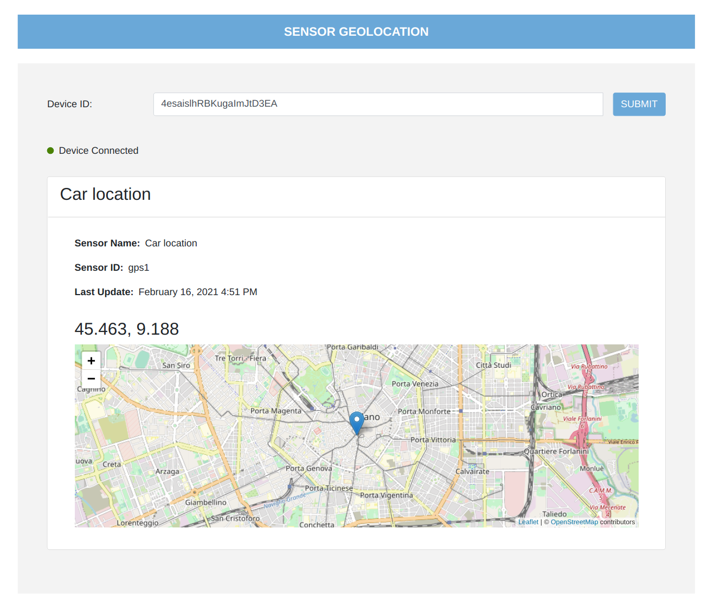

<!--
Copyright 2021 SECO Mind Srl

SPDX-License-Identifier: Apache-2.0
-->

# Sensor Geolocation example

This is a sample web page made in React that you can use to show positional data coming from GPS sensors of a device.

You can follow the walkthrough below if you wish to try it out: you will first simulate a device
that streams data from its GPS sensor to Astarte, then use this web page to show the sensor's location on a map.

## Prerequisites

For this example you should:

1. have an Astarte instance up and running with a realm you have access to
2. install the [example interfaces](../../standard-interfaces/) in the realm
3. register a device that will use those interfaces in the realm; note down its device ID and
   Credentials Secret
4. have [NodeJS](https://nodejs.org/) installed on your machine and serve this web page with
   ```sh
   npm install
   npm run start
   ```

If all went well, you should see a form where you can supply:

- the base URL of the Astarte instance
- the name of your realm
- a valid JWT access token for the realm that can be used to communicate with AppEngine

## Elixir walkthrough

A device SDK, such as the
[Elixir SDK](https://github.com/astarte-platform/astarte-device-sdk-elixir), can be used to simulate
the device and:

- advertise a GPS sensor to Astarte, via the `AvailableSensors` interface
- stream some data from the GPS sensor to Astarte, via the `Geolocation` interface

You can download a local copy of the Elixir SDK on your machine, install
[Elixir](https://elixir-lang.org/), and launch an interactive session with the SDK with:

```sh
iex -S mix
```

Let's first load some useful variables in the interactive session; replace right members of the
assignments as needed:

```elixir
device_id = "DEVICE_ID"
credentials_secret = "DEVICE_CREDENTIALS_SECRET"
realm = "REALM_NAME"
pairing_url = "PAIRING_URL"
interfaces_folder = "/path/to/interfaces"
```

Note that `interfaces_folder` is the folder on your machine where you have the JSON definitions for
the [example interfaces](../../standard-interfaces/).

We can pass these options to the SDK to create a virtual Device and have it connected to the realm:

```elixir
opts = [pairing_url: pairing_url, realm: realm, device_id: device_id, credentials_secret: credentials_secret, interface_provider: interfaces_folder, ignore_ssl_errors: true]
{:ok, pid} = Astarte.Device.start_link(opts)
```

The virtual Device should now be connected. Let's use it to advertise a GPS sensor that will stream data adherent to W3C specs:

```elixir
Astarte.Device.set_property(pid, "org.astarte-platform.genericsensors.AvailableSensors", "/gps1/name", "Car location")
Astarte.Device.set_property(pid, "org.astarte-platform.genericsensors.AvailableSensors", "/gps1/unit", "W3C")
```

You can now stream a sample GPS measurement:

```elixir
Astarte.Device.send_datastream(pid, "org.astarte-platform.genericsensors.Geolocation", "/gps1",  %{ latitude: 45.463, longitude: 9.188 })
```

Going back to the web page of this example, you can input the device ID to retrieve the device's location and display it on map:


